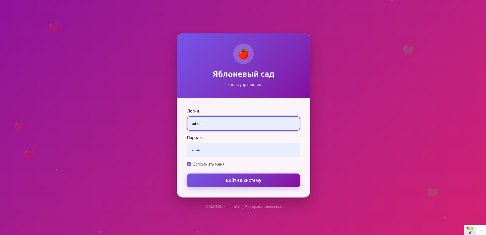
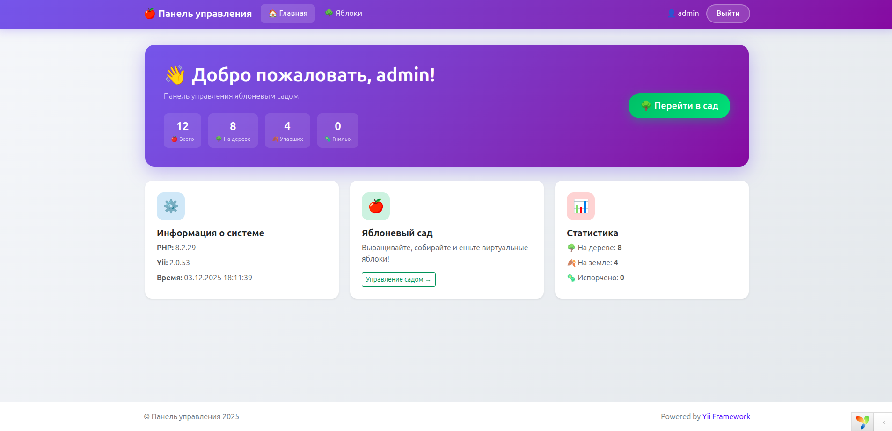
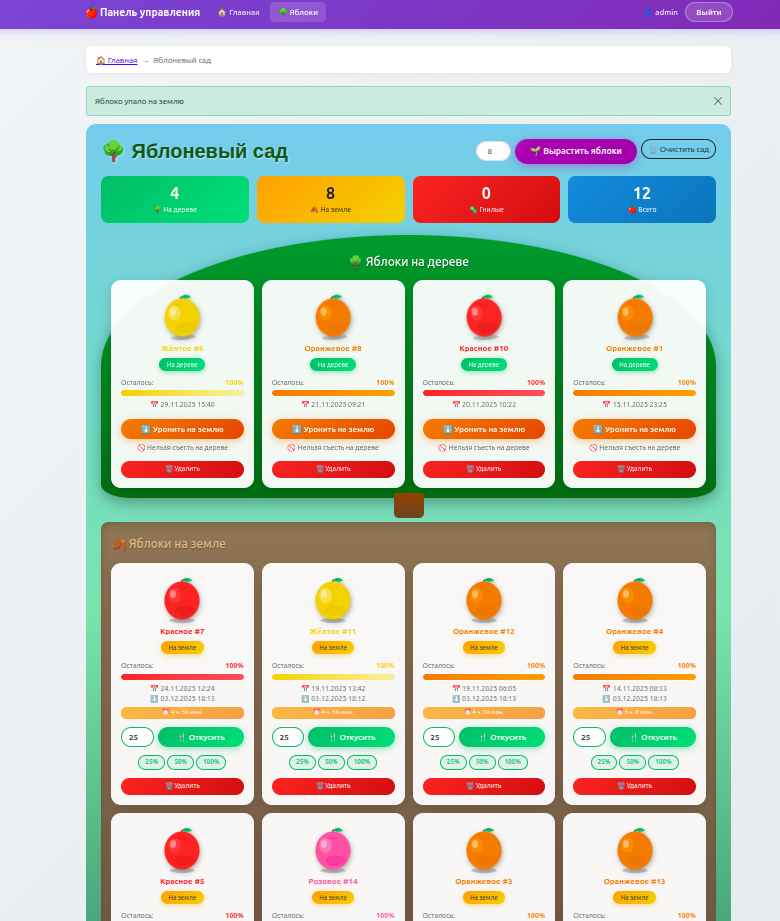

# 🍎 Яблоневый сад

<p align="center">
    
    
    
    
</p>

<p align="center">
    <b>Демонстрационный проект на Yii2 Advanced Template</b><br>
    Симулятор яблоневого сада с полной реализацией жизненного цикла яблок
</p>

---

## 📋 Описание

Проект демонстрирует реализацию объектно-ориентированного подхода на примере класса `Apple` с хранением данных в MySQL. Приложение позволяет управлять виртуальными яблоками: выращивать их на дереве, ронять на землю, есть и наблюдать за порчей.

### 🎯 Основные возможности

- ✅ Генерация яблок со случайными параметрами (цвет, дата появления)
- ✅ Три состояния яблока: на дереве → на земле → гнилое
- ✅ Механика поедания яблок (по процентам)
- ✅ Автоматическая порча через 5 часов после падения
- ✅ Красивый графический интерфейс с SVG-яблоками
- ✅ Защищённая админ-панель (авторизация)

---

## 🎮 Правила симуляции

| Состояние | Можно съесть | Может испортиться |
|-----------|:------------:|:-----------------:|
| 🌳 На дереве | ❌ | ❌ |
| 🍂 На земле | ✅ | ✅ (через 5 часов) |
| 🦠 Гнилое | ❌ | - |

**Дополнительно:**
- При съедании 100% яблоко удаляется из базы данных
- Процент съедания вычисляется от **оставшегося** размера яблока

---

## 🛠 Установка

### Требования

- PHP 8.0+
- MySQL 5.7+ / MariaDB 10.3+
- Composer 2.x

### Шаги установки

```bash
# 1. Клонировать репозиторий
git clone https://github.com/your-username/apple-garden.git
cd apple-garden

# 2. Установить зависимости
composer install

# 3. Инициализировать проект
php init --env=Development --overwrite=All

# 4. Настроить подключение к БД
# Отредактируйте файл common/config/main-local.php
```

```php
// common/config/main-local.php
'db' => [
    'class' => \yii\db\Connection::class,
    'dsn' => 'mysql:host=127.0.0.1;dbname=yii2advanced',
    'username' => 'root',
    'password' => 'YOUR_PASSWORD',
    'charset' => 'utf8',
],
```

```bash
# 5. Создать базу данных
mysql -u root -p -e "CREATE DATABASE yii2advanced CHARACTER SET utf8mb4 COLLATE utf8mb4_unicode_ci;"

# 6. Выполнить миграции
php yii migrate --interactive=0

# 7. Создать администратора
php yii admin/create admin admin@example.com password123

# 8. Запустить сервер разработки
cd backend/web && php -S localhost:8080
```

---

## 🚀 Использование

### Веб-интерфейс

1. Откройте http://localhost:8080
2. Войдите с учётными данными администратора
3. Перейдите в раздел "🌳 Яблоки"
4. Нажмите "Вырастить яблоки" для генерации

### Консольные команды

```bash
# Создать администратора
php yii admin/create <username> <email> <password>

# Список администраторов
php yii admin/list

# Сменить пароль
php yii admin/change-password <username> <new_password>
```

---

## 📁 Структура проекта

```
yii2/
├── backend/                    # Административная панель
│   ├── controllers/
│   │   ├── AppleController.php # Контроллер яблок
│   │   ├── BaseController.php  # Базовый контроллер с авторизацией
│   │   └── SiteController.php  # Главный контроллер
│   └── views/
│       ├── apple/
│       │   ├── index.php       # Страница сада
│       │   └── _apple_card.php # Карточка яблока (SVG)
│       ├── layouts/
│       │   ├── main.php        # Основной шаблон
│       │   └── blank.php       # Шаблон для логина
│       └── site/
│           ├── index.php       # Главная страница
│           └── login.php       # Страница входа
│
├── common/                     # Общие компоненты
│   └── models/
│       ├── Apple.php           # Модель яблока ⭐
│       ├── LoginForm.php       # Форма входа
│       └── User.php            # Модель пользователя
│
├── console/                    # Консольные команды
│   ├── controllers/
│   │   └── AdminController.php # Управление админами
│   └── migrations/
│       ├── m130524_201442_init.php
│       ├── m190124_110200_add_verification_token_column_to_user_table.php
│       └── m251203_174843_create_apple_table.php
│
└── frontend/                   # Публичная часть (не используется)
```

---

## 🍎 Класс Apple

### Константы

```php
const STATUS_ON_TREE = 0;   // На дереве
const STATUS_FALLEN = 1;    // Упало
const STATUS_ROTTEN = 2;    // Гнилое

const ROTTEN_TIME = 5 * 60 * 60; // 5 часов до порчи

const COLORS = [
    'red'    => '#e74c3c',
    'green'  => '#27ae60',
    'yellow' => '#f1c40f',
    'orange' => '#e67e22',
    'pink'   => '#fd79a8',
];
```

### Методы

| Метод | Описание |
|-------|----------|
| `createRandom(?string $color)` | Создаёт яблоко со случайными параметрами |
| `fallToGround()` | Яблоко падает с дерева |
| `eat(float $percent)` | Съесть часть яблока (% от остатка) |
| `checkRottenStatus()` | Проверить и обновить статус порчи |

### Геттеры

| Свойство | Тип | Описание |
|----------|-----|----------|
| `$apple->size` | float | Оставшийся размер (0-1) |
| `$apple->isOnTree` | bool | На дереве? |
| `$apple->isFallen` | bool | На земле? |
| `$apple->isRotten` | bool | Испорчено? |
| `$apple->statusLabel` | string | Текстовый статус |
| `$apple->colorHex` | string | HEX-код цвета |
| `$apple->colorLabel` | string | Название цвета |
| `$apple->timeUntilRotten` | int\|null | Секунд до порчи |

### Пример использования

```php
// Создание яблока
$apple = Apple::createRandom('green');
$apple->save();

echo $apple->color;  // green
echo $apple->size;   // 1

// Попытка съесть на дереве - исключение!
$apple->eat(50); // InvalidCallException: Съесть нельзя, яблоко на дереве

// Уронить на землю
$apple->fallToGround();

// Теперь можно есть
$apple->eat(25);     // Откусить 25% от оставшегося
echo $apple->size;   // 0.75

$apple->eat(100);    // Съесть полностью - яблоко удаляется из БД
```

---

## 🎨 Скриншоты

### Страница входа
<!--  -->
- Анимированный градиентный фон с переливами цветов
- Плавающие частицы и яблоки на заднем плане
- Современная карточка с градиентной шапкой

### Главная панель управления  
<!--  -->
- Hero-секция со статистикой яблок
- Информационные карточки
- Быстрый доступ к саду

### Яблоневый сад
<!--  -->
- SVG-графика яблок с бликами и тенями
- Визуальное разделение: дерево / земля / компост
- Анимация качания яблок на ветках
- Плавающие облака на небе

### Состояния яблок

| Состояние | Описание |
|-----------|----------|
| 🌳 На дереве | Зелёная крона дерева, яблоки качаются на ветру |
| 🍂 На земле | Коричневая секция, таймер до порчи |
| 🦠 Гнилое | Тёмная секция, серый фильтр на яблоке |

<!-- 
Для добавления скриншотов:
1. Сделайте скриншоты страниц
2. Сохраните в папку docs/screenshots/
3. Раскомментируйте строки с 
-->

---

## 🔐 Безопасность

- Все страницы backend защищены авторизацией
- Пароли хранятся в хэшированном виде (bcrypt)
- CSRF-защита на всех формах
- Валидация входных данных

---

## 📝 Лицензия

MIT License

---

## 👨‍💻 Автор

Создано с ❤️ и 🍎

---

<p align="center">
    
    
</p>
